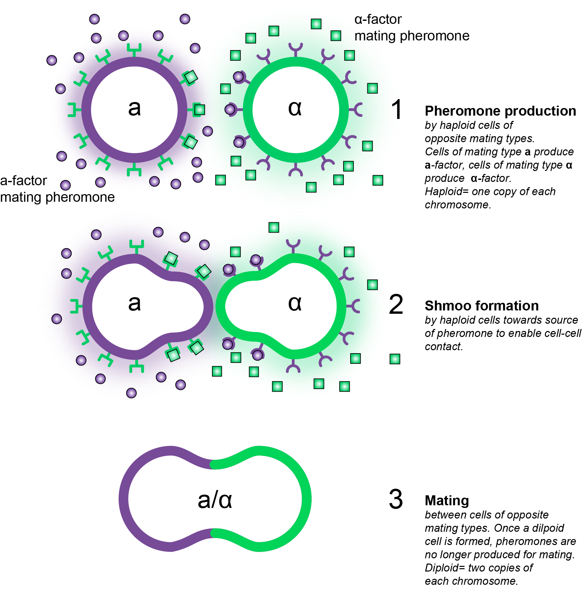

## Introduction

This exercise will use RNA Seq data (gene counts) from cultures of *Saccharomyces cerevisiae* of mating type **a** that have been externally treated with a pheromone called **‘alpha factor’**. In the wild, haploid yeast cells mate via the production of pheromones (Figure 1), which signals their presence to neighboring cells. When cells of the opposite mating type sense each other (via their pheromones) they respond by forming ‘shmoos’, growth projections that allow cells to make contact and subsequently mate to form a diploid cell. The aim of this work was therefore to find out how pheromone treatment affects cells, from a genome-wide perspective.

```{r, echo=FALSE, fig.align = 'center', out.width = "75%", fig.cap = "**Figure 1** Adapted from Wikipedia"}

```

## R session setup

Data is here is classified as either pheromone-affected or pheromone-unaffected. The count data files are located in the **data/gene_counts/** subdirectory in the **'Day4'** directory.

The gene_counts_glucose.txt dataset corresponds to glucose as the carbon source, whereas the gene_counts_ethanol.txt dataset used ethanol. This was to show the effect of pheromone on cells undergoing two different types of metabolism: fermentation (with glucose) or respiration (with ethanol). Each dataset includes 6 pheromone-affected samples, and several pheromone-unaffected samples (24 for glucose, 15 for ethanol).

1. Start R and use setwd() (or Session > Set Working Directory > Choose Directory… from the top menu bar) to change the working directory to the Day4/ directory, which should contain a subdirectory named data/.
```{r setup, include=FALSE,warning=FALSE,echo=TRUE,message=FALSE}
knitr::opts_chunk$set(echo = TRUE)
# setwd("~/Documents/Course/MESB/Day4")
# setwd('~/Documents/MESB')
# setwd('~/Work/MESB')

# Confirm we're in the right directory and look at its content:
getwd()
dir()
```

2. We will use the following R packages in this exercise:
```{r library,warning=FALSE,echo=TRUE,message=FALSE}
# Load R-packages required for analysis
# First time: need to install the packages. Once installed, you don't need to repeat these commands above (you can comment them out with a #-sign in front).

# After installing the software the first time, load the R-packages that we need. This you need to do every time you start a new R session.
library(limma)
library(edgeR)
library(tidyverse)
library(RColorBrewer)
#If you are unable to load the package, try to install it using the following commands:
# if (!require("BiocManager", quitely = TRUE))                      
#  install.packages("BiocManager", dependencies = TRUE)
# BiocManager::install(c("edgeR"), update = TRUE, ask = FALSE)
```

## Load data

3. Begin by loading the count data corresponding to the experiment of interest (glucose or ethanol conditions):
```{r load data}
count.data <- read.delim('data/gene_counts/gene_counts_glucose.txt', stringsAsFactors=F, row.names=1)
# count.data <- read.delim('data/gene_counts/gene_counts_ethanol.txt', stringsAsFactors=F, row.names=1)

# preview the first few rows of the data
head(count.data)
# View(count.data)    #you may have a look at the count data in Rstudio
```

> **Question 1**: How many genes are in the dataset?

> **Answers:**


## Differential expression analysis

We will perform a differential expression (DE) analysis using the [edgeR](https://bioconductor.org/packages/release/bioc/html/edgeR.html). This exercise uses/explains only a little of edgeR, so it is strongly encouraged that you take a look at the [edgeR User’s Guide](https://bioconductor.org/packages/release/bioc/vignettes/edgeR/inst/doc/edgeRUsersGuide.pdf). 
Another package that is commonly used for DE analysis is [DESeq2](https://bioconductor.org/packages/release/bioc/html/DESeq2.html), which also has a very nice [User’s Guide](https://bioconductor.org/packages/release/bioc/vignettes/DESeq2/inst/doc/DESeq2.html). Although DESeq2 will not be covered in this exercise, we encourage you to check it out sometime.

### Data setup and exploration
We want to determine which genes are differentially expressed between two groups of samples - in this case, between “pheromone-unaffected” and “pheromone-affected” samples, which we have indicated by column names beginning with a “U” or “P”, respectively. We can take a quick look at the column names to see what samples we have:
```{r}
colnames(count.data)
```

4. Generate a factor specifying the group to which each sample belongs:
```{r set up groups}
sample.groups <- factor(startsWith(colnames(count.data), 'P'), labels=c('unaffected','pheromone'))
#check that we set up the groups correctly
data.frame(sample=colnames(count.data), groups=sample.groups)
```

5. Create a DGEList object from the count.data dataframe and sample.groups factor:
```{r creat DGEList}
y <- DGEList(counts=count.data, group=sample.groups)
```
This DGEList object ‘holds’ the dataset to be analysed by edgeR and the subsequent calculations relevant for the analysis.

Before performing any DE analysis, we can take a look at similarities and differences among different samples using a multidimensional scaling (MDS) plot:
```{r MDS plot}
plotMDS(y, cex=0.8) #"ces" sets the label font size
```

> **Question 2**: What is MDS, and how does it compare/contrast with related techniques, such as principal component analysis (PCA)?

> **Answer:** 

> **Question 3**: Does it look like our samples are grouping/separating well based on their pheromone status? Do you notice any other patterns in the data?

> **Answer:** 

### Filtering and normalization
Often, RNA Seq data will contain low-count genes that are not expressed, or expressed at very low levels in many samples. The data for these genes is essentially noise that does not provide any meaningful information and should therefore be removed prior to DE analysis.

Although there is no single “correct” approach for removing low-count genes, a common technique involves removing those that are below some threshold in a given fraction of the samples.

6. Filter (remove) low-count genes from the count data, using an arbitrary cut off of 10 reads:
```{r filtering low reads, warning=FALSE,echo=TRUE,message=FALSE}
#Normalize for library size, by taking the log count-per-million. It's not a satisfactory normalization, but we just use it to plot raw reads
cpm <- cpm(y)
lcpm <- cpm(y, log = T)

#Plot raw logCPM reads before filtering
nsamples <- ncol(y)
col <- brewer.pal(nsamples, "Paired") # Ignore warning, some samples will have identical color.
par(mfrow = c(1, 2))
plot(
    density(lcpm[, 1]),
    col = col[1],
    ylim = c(0, 0.6),
    las = 2, 
    main = "A. Raw data",
    xlab = "Log-cpm")
abline(v = 0, lty = 3)
for (i in 2:nsamples) {
  den <- density(lcpm[, i])
  lines(den$x, den$y, col = col[i])
}


#Filter with filterByExpr function
keep <- filterByExpr(y, min.count = 10)
y_Filtered <- y[keep, keep.lib.sizes=F]

#Plot new logCPM reads after filtering
lcpm <- cpm(y_Filtered, log = T)

plot(density(lcpm[, 1]),
     col = col[1],
     ylim = c(0, 0.6), 
     las = 2,
     main = "B. filterByExpr",
     xlab = "Log-cpm")
abline(v = 0, lty = 3)
for (i in 2:nsamples) {
  den <- density(lcpm[, i])
  lines(den$x, den$y, col = col[i])
}
```

The **filterByExpr** function will only keep genes that have at least **min.count** counts per million (CPM) in at least **n** samples, where **n** is the number of samples in the smallest group (the **pheromone** group, in this case, where **n = 6**).

The **keep.lib.sizes=F** argument specifies that we want to recalculate the sample library sizes after removing the low-count genes from the data.


The next step is to normalize the data by RNA composition, in order to address problems caused by the counts in a sample being dominated by only a few highly expressed genes. This can cause other genes in the sample to exhibit artificially low count values. The normalization factors calculated using the **calcNormFactors** function are then used to scale the counts to avoid such problems.

7. Calculate the normalization factors for each sample:
```{r normalization}
#Calculate the normalization factors for each sample
y_TMM <- calcNormFactors(y_Filtered)

#To view the normalization factors calculated for each sample (as well as library sizes), we can take a look at the samples attribute of our DGEList, y:
y_TMM$samples


#Let's check the effect
lcpm_y_Filtered <- cpm(y_Filtered, log = TRUE) #calculate lcpm of non-normalized data
lcpm_y_TMM <- cpm(y_TMM, log = TRUE) #calculate lcpm normalized data

#boxplot to check effect normalization (without outliers)
par(mfrow=c(2,2))
boxplot(lcpm_y_Filtered, las= 3, outline = FALSE, main = "Not normalized - No outliers", ylab = "Log-CPM")
boxplot(lcpm_y_TMM, las = 3, outline = FALSE, main = "Normalized - No outliers", ylab = "Log-CPM")

#boxplot to check effect normalization (with outliers)
boxplot(lcpm_y_Filtered, las= 3, outline = TRUE, main = "Not normalized - Outliers", ylab = "Log-CPM")
boxplot(lcpm_y_TMM, las = 3, outline = TRUE, main = "Normalized - Outliers", ylab = "Log-CPM")
```

### Dispersion estimation
We can analyze using pairwise contrasts, or using a generalized linear model. Here is demonstrated how to do pairwise.

8. Estimate the dispersion across all genes:
```{r dispersion estimation, warning=FALSE,echo=TRUE,message=FALSE}
#Using the grouping, we can now do an additional correction for the mean-variance correlation
y_MV <- estimateDisp(y_TMM)
#We can also view the dispersion estimates using the BCV plot:
plotBCV(y_MV)
```

The results of this plot give us an idea about the variance across all genes that are lowly expressed all the way to highly expressed. Normally, the more lowly expressed genes will have larger variation compared to the more highly expressed genes. (“Tagwise” is gene by gene dispersion, “common” is dispersion aross the whole dataset and “trend” takes groups of similarily expressed genes plot dispersion.)

### Test for differential expression
9. Now we can get lists of DE genes using the **exactTest** function:
```{r}
et <- exactTest(y_MV)
# This will compare 'pheromone' with 'unaffected'. Show top 20 results:
topTags(et, n=20)  
```

> **Question 4**: Take a closer look at these genes (you can use the [Saccharomyces Genome Database](https://www.yeastgenome.org/) for help). Do you see anything interesting related to their functions?

> **Answer:** 

The table of DE results is saved in et$table, but it does not contain the FDR-adjusted p-values. We can add this using the **p.adjust** function:
```{r}
res.table <- et$table
res.table$FDR <- p.adjust(res.table$PValue, 'BH')  # BH = Benjamini-Hochberg method
```

For a brief recap on why FDR adjustment is important, during multiple testing, take a look [here](https://www.explainxkcd.com/wiki/index.php/882:_Significant).

Now we can view DE genes:
```{r}
# Make a smear plot, highlighting as DE those genes that have FDR < 0.01
plotSmear(y_MV, de.tags = rownames(
  res.table)[res.table$FDR < 0.01 & abs(res.table$logFC) > 1])

# If you want to save a plot, you can easily do this by (1) specifying the pdffunction, (2) making the plot, and (3) switching off the writing of files.
pdf("data/DE_results/smearPlot.pdf")
plotSmear(y_MV, de.tags = rownames(
  res.table)[res.table$FDR < 0.01 & abs(res.table$logFC) > 1])
dev.off()

# Make histogram of p-values, add vertical line at p = 0.05
hist(res.table$PValue, breaks = 100)
abline(v = 0.05, col = 'red')

# Make volcano plot
volcanoData <- cbind(res.table$logFC, -log10(res.table$FDR))
colnames(volcanoData) <- c("logFC", "-log10Pval")
plot(volcanoData)
abline(v = c(-2, 2), col = 'red')
abline(h = 3, col = 'red')
```

### Export results
10. Export the results table to a .txt file:
```{r}
# note: this command will overwrite the existing pre-generated DE_results_glucose.txt file
write.table(res.table, file = 'data/DE_results/DE_results_glucose.txt', quote=F, sep='\t')
```

## Data with multiple variables
In many cases, samples can be classified/grouped by more than one experimental variable/condition. For example, in a clinical trial, we may have untreated and treated subjects, as well as male and female. Often, we may want to look at differences between the different grouping types (untreated vs. treated, and male vs. female), or attempt to prevent factors associated with one variable influencing our analysis of another. For example, if we are only interested in the effect of the drug treatment, we don’t want differences in subject gender to bias the results.

Such cases can be approached using generalized linear models (GLMs). In this case, the variables deemed important by the scientist (that’s you) can be included together in a linear model, that is fit to the data, thus enabling estimation of expression changes based on those variables.

### Data setup and exploration
We avoided such a situation in the example above by separating the glucose and ethanol conditions into two separate datasets, which were analyzed individually. But what if we wanted to combine these data together?

11. Import both gene count files:
```{r}
# load the glucose data, and append column names with a "g"
glucose.data <- read.delim('data/gene_counts/gene_counts_glucose.txt',
                           stringsAsFactors=F, row.names=1)
colnames(glucose.data) <- paste(colnames(glucose.data), 'g', sep='')

# load the ethanol data, and append column names with a "e"
ethanol.data <- read.delim('data/gene_counts/gene_counts_ethanol.txt',
                           stringsAsFactors=F, row.names=1)
colnames(ethanol.data) <- paste(colnames(ethanol.data), 'e', sep='')
```

12. Merge the count data by gene IDs (row names):
```{r}
# merge datasets (by=0 indicates we merge by row names)
count.data_m <- merge(glucose.data, ethanol.data, by=0)

# set the row names as the gene IDs, and remove the "Row.names" column
row.names(count.data_m) <- count.data_m$Row.names
count.data_m <- count.data_m[,-1]

# preview our merged dataframe
head(count.data_m)
```

13. As before, create a DGEList object from the count.data dataframe:
```{r}
y_m <- DGEList(counts=count.data_m)
```

Notice that this time, we did not specify the sample groups when creating our DGEList. The group is only specified at this step when dealing with a single variable (as in the example above), which is no longer the case. We will specify the sample grouping assignments in the next step.

14. Take a look at the multidimensional scaling (MDS) plot (using colors this time):
```{r}
plotMDS(y_m, pch=16, 
        col=c(rep('red',6), rep('blue',24), rep('orange',6), rep('purple',15)))
legend(-2.5,-1.3, c('Pheromone Glc', 'Unaffected Glc', 'Pheromone EtOH', 'Unaffected EtOH'),
       col=c('red','blue','orange','purple'), pch=16, cex=0.9)
```

> **Question 5**: What do you see? Are you surprised by this result?

> **Answer:**

### Data classification
15. Generate a design matrix to classify each of our samples based on carbon source and pheromone status:
```{r}
# specify pheromone and carbon attribute of each sample
pheromone <- factor(startsWith(colnames(count.data_m), 'P'), labels=c('unaffected','pheromone'))
carbon <- factor(endsWith(colnames(count.data_m), 'e'), labels=c('glucose','ethanol'))

# generate design matrix
design <- model.matrix(~carbon + pheromone)
rownames(design) <- colnames(y_m)
```

> **Question 6**: Does the design matrix make sense?

> **Answer:**


### Data filtering, normalization, and dispersion
16. Filter low-count genes from the count data, this time by providing our design matrix as sample groups were not specified in the DGEList object:
```{r}
keep <- filterByExpr(y_m, design=design, min.count = 10)
y_m <- y_m[keep, , keep.lib.sizes=F]
```

17. Calculate the normalization factors for each sample:
```{r}
y_m <- calcNormFactors(y_m)
```

18. Estimate the dispersion across all genes:
```{r}
y_m <- estimateDisp(y_m, design)  # now further informed by design matrix
```

19. Take a look at the BCV plot:
```{r}
plotBCV(y_m)
```

### GLM fitting and DE estimation
We are now ready to fit our GLM to the count data. To do this, we will use the glmQLFit function, which fits a **quasi-likelihood** negative binomial model to the count data.

What this means is that we are fitting each gene’s mean expression and variance to a negative binomial distribution, which has been found to sufficiently approximate the observed distribution of RNA-Seq data. However, the use of this distribution alone can still lead to an underestimation of the false-discovery rate (i.e., too many significant genes). Therefore, the “quasi-likelihood” approach includes an additional parameter when fitting the GLM that incorporates uncertainty of the modeled variances, yielding a more accurate representation (see, e.g., [S. P. Lund, et al. (2012) Stat Appl Genet Mol Biol](https://www.degruyter.com/document/doi/10.1515/1544-6115.1826/html)).

20. Fit the GLM:
```{r}
fit <- glmQLFit(y_m, design)
# Inspect the coefficients that are found
head(fit$coefficients)
```

Alternatively, we could use the glmFit function, which uses a slightly different algorithm. You can find more details in the [edgeR User’s Guide](https://bioconductor.org/packages/release/bioc/vignettes/edgeR/inst/doc/edgeRUsersGuide.pdf). Now we want to use our fitted GLM to estimate the expression change between the pheromone-affected and pheromone-unaffected samples, while ignoring differences associated with the carbon source (glucose vs. ethanol). To do so, we will perform what is known as “blocking”, where the effect of the carbon source difference is “blocked” from our expression change estimation.

21. Perform a likelihood test to estimate gene expression changes caused by the pheromone:
```{r}
qlf <- glmQLFTest(fit)
 # take a look at the most affected genes
topTags(qlf, n=20)
```

Notice we didn’t specify which comparison we wanted to perform (pheromone affected vs. unaffected, or glucose vs. ethanol). This is because by default the **glmQLFTest** function will test the last (3rd) coefficient in the model (**pheromone** in our case). If we instead wanted to look at gene expression changes between glucose and ethanol samples, we would specify this using the **coef** argument: e.g., **qlf <- glmQLFTest(fit, coef=2)**, because the 2nd coefficient relates to carbon source (the 1st coefficient is simply the intercept, or baseline).

22. Add the FDR values to the results table:
```{r}
res.table_m <- qlf$table
res.table_m$FDR <- p.adjust(res.table_m$PValue, 'BH')  # BH = Benjamini-Hochberg method
```

23. Now we can view DE genes:
```{r}
# Make a smear plot, highlighting as DE those genes that have FDR < 0.01
plotSmear(qlf, de.tags = rownames(
  res.table_m)[res.table_m$FDR < 0.01 & abs(res.table_m$logFC) > 1])

# Make histogram of p-values, add vertical line at p = 0.05
hist(res.table_m$PValue, breaks = 100)
abline(v = 0.05, col = 'red')

# Make volcano plot
volcanoData_m <- cbind(res.table_m$logFC, -log10(res.table_m$FDR))
colnames(volcanoData_m) <- c("logFC", "-log10Pval")
plot(volcanoData_m)
abline(v = c(-2, 2), col = 'red')
abline(h = 3, col = 'red')
```

> **Question 7**: How do these results compare to those in the first analysis?

> **Answer:**


### Export
24. Export the results table to a .txt file:
```{r}
write.table(res.table_m, file = 'data/DE_results/DE_results_merged.txt', quote=F, sep='\t')
```

## Session info

This page was generated using the following R session:
```{r session info, echo=FALSE}
R.version
```

Note that the `echo = FALSE` parameter was added to the code chunk to prevent printing of the R code that generated the plot.
